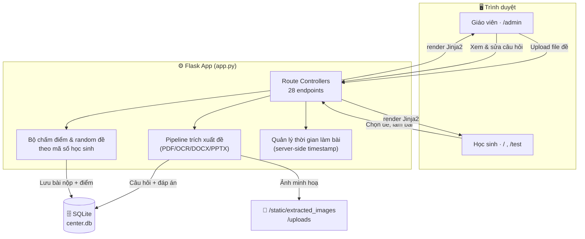
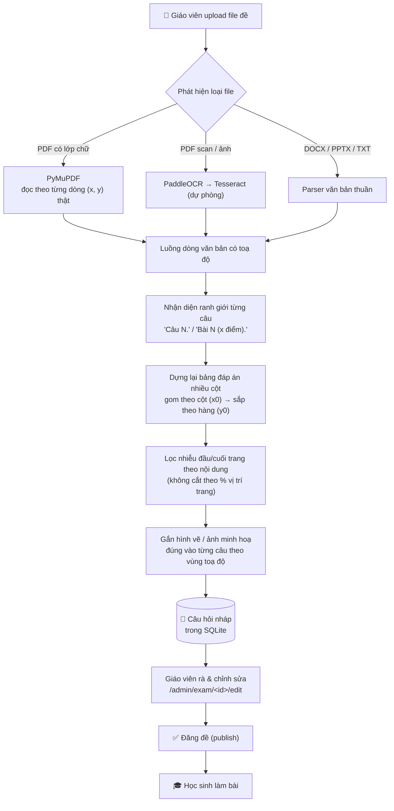
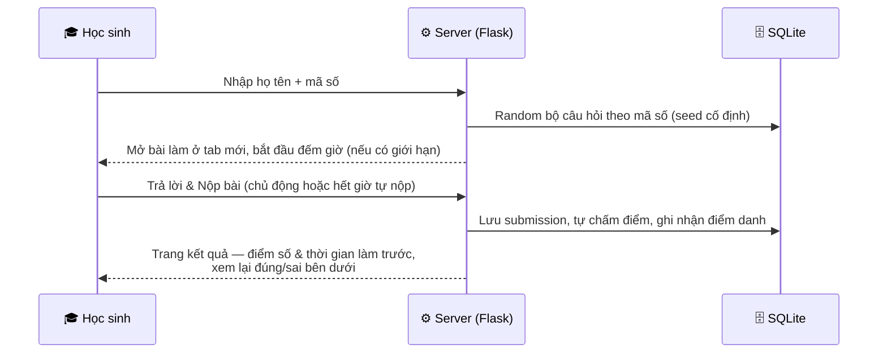

# 📚 Hệ thống Kiểm tra Trực tuyến cho Trung tâm Luyện thi

**Tự động hoá toàn bộ quy trình ra đề → làm bài → chấm điểm → điểm danh cho một trung tâm luyện thi vừa và nhỏ.**
Giáo viên chỉ cần upload file đề gốc (PDF/DOCX/PPTX/ảnh scan) — hệ thống tự đọc, tách câu hỏi/đáp án/hình ảnh,
dựng thành bài kiểm tra online, học sinh làm bài và được chấm điểm ngay lập tức.

> Dự án cá nhân, xây dựng và vận hành thực tế cho một trung tâm luyện thi tại TP.HCM, nơi tôi làm trợ giảng.

<!-- 🖼️ TODO: chèn ảnh chụp màn hình (trang học sinh, trang giáo viên, trang kết quả) và link demo tại đây -->

---

## Mục lục

- [Vấn đề & Giải pháp](#vấn-đề--giải-pháp)
- [Tính năng chính](#tính-năng-chính)
- [Kiến trúc hệ thống](#kiến-trúc-hệ-thống)
- [Pipeline trích xuất đề thi](#pipeline-trích-xuất-đề-thi)
- [Luồng làm bài của học sinh](#luồng-làm-bài-của-học-sinh)
- [Cấu trúc thư mục](#cấu-trúc-thư-mục)
- [Công nghệ sử dụng](#công-nghệ-sử-dụng)
- [Cài đặt & chạy thử](#cài-đặt--chạy-thử)
- [Giới hạn hiện tại & hướng phát triển](#giới-hạn-hiện-tại--hướng-phát-triển)
- [Kỹ năng thể hiện qua dự án](#kỹ-năng-thể-hiện-qua-dự-án)

---

## Vấn đề & Giải pháp

Quy trình kiểm tra thủ công tại trung tâm trước đây: giáo viên soạn đề trên Word/PDF → in ra hoặc gửi file →
học sinh làm trên giấy hoặc gõ lại → giáo viên chấm tay từng bài → ghi điểm danh thủ công. Tốn thời gian,
dễ sai sót, không có dữ liệu để theo dõi tiến độ học sinh theo thời gian.

**Giải pháp:** một web app chạy được ngay trên máy nội bộ trung tâm, đóng vai trò cầu nối giữa **đề thi có sẵn**
(định dạng trung tâm vẫn dùng hằng ngày, không bắt giáo viên đổi thói quen soạn đề) và **bài kiểm tra online**
tự chấm. Điểm khác biệt so với việc "dùng Google Form" thông thường: hệ thống **tự đọc hiểu file đề gốc**
(PDF native, PDF scan, Word, PowerPoint) thay vì bắt giáo viên nhập lại từng câu hỏi bằng tay.

## Tính năng chính

**Dành cho giáo viên**

- Upload đề thi (PDF/DOCX/PPTX/ảnh) → hệ thống tự tách câu hỏi, đáp án A/B/C/D và hình ảnh minh hoạ
- Màn hình xem & sửa lại toàn bộ câu hỏi trước khi đăng, để đảm bảo hoàn toàn đúng 100% trước khi học sinh làm
- Đặt lịch mở đề, giới hạn thời gian làm bài, quản lý tài liệu tham khảo riêng
- Xem danh sách bài nộp, thống kê điểm theo từng đề

**Dành cho học sinh**

- Vào trang chủ, chọn đề đang mở, nhập họ tên + mã số → làm bài ngay trên trình duyệt (mở ở tab riêng)
- Đồng hồ đếm ngược nếu đề có giới hạn thời gian, tự nộp bài khi hết giờ, hoặc nộp sớm chủ động
- Nộp bài xong xem điểm, thời gian làm bài và xem lại chi tiết câu đúng/sai ngay lập tức
- Việc nộp bài đồng thời được ghi nhận là **điểm danh có mặt buổi học**

## Kiến trúc hệ thống

Ứng dụng Flask đơn khối (monolith), render giao diện bằng Jinja2, lưu dữ liệu bằng SQLite — ưu tiên đơn giản,
dễ triển khai trên máy trung tâm mà không cần hạ tầng phức tạp.



## Pipeline trích xuất đề thi

Đây là phần lõi kỹ thuật của dự án: biến một file đề "để con người đọc" (PDF in, ảnh scan, Word...) thành
dữ liệu có cấu trúc (câu hỏi / đáp án A-B-C-D / hình ảnh) mà **không cần dùng AI/LLM đoán nội dung** — toàn bộ
là parser xác định (deterministic), dựa trên toạ độ chữ thật trong file và các mẫu hình thức đề thi thực tế
của trung tâm, để đảm bảo độ chính xác gần như tuyệt đối và không "ảo giác" thêm/bớt nội dung.



**Vì sao thiết kế lại theo hướng dòng-toạ-độ thay vì đọc theo khối văn bản thô:** các mẫu đề thật của trung
tâm có hai lỗi hình thức rất phổ biến mà cách đọc theo "khối" (block) đơn thuần không xử lý được —
(1) nhiều câu hỏi liền nhau không có dòng trống, dễ bị gộp nhầm vào một khối; (2) đáp án A/B/C/D trình bày
dạng lưới 2–4 cột, khiến thứ tự trích xuất gốc của PDF bị xáo trộn. Pipeline hiện tại xử lý cả hai bằng cách
làm việc trực tiếp trên toạ độ thật của từng dòng chữ, thay vì tin vào thứ tự do thư viện PDF trả về.

## Luồng làm bài của học sinh



## Cấu trúc thư mục

```
project_hethongbaitap/
├── app.py                     # Toàn bộ backend: routes, pipeline trích xuất, chấm điểm, DB schema
├── center.db                  # SQLite — tự tạo/migrate khi chạy lần đầu
├── static/
│   ├── style.css
│   ├── logo.png
│   └── extracted_images/      # Ảnh/hình vẽ được cắt ra từ đề, gắn theo từng câu
├── templates/                 # Giao diện Jinja2
│   ├── base.html / _admin_tabs.html
│   ├── home.html               # Trang chủ học sinh — danh sách đề đang mở
│   ├── entry.html               # Nhập họ tên + mã số
│   ├── test.html                 # Giao diện làm bài (đồng hồ đếm ngược, nộp bài)
│   ├── result.html                # Điểm số + xem lại đúng/sai
│   ├── admin_home.html            # Dashboard giáo viên — danh sách đề
│   ├── admin_edit.html             # Rà & sửa câu hỏi sau khi trích xuất
│   ├── admin_submissions.html       # Danh sách bài nộp theo đề
│   ├── admin_documents.html / documents.html   # Tài liệu tham khảo
│   └── info.html                    # Thống kê / điểm danh
└── uploads/                   # File đề gốc giáo viên upload (lưu lại để đối chiếu)
```

## Công nghệ sử dụng

| Nhóm | Công nghệ | Vai trò |
|---|---|---|
| Backend | Flask (Python) | Route controller, xử lý nghiệp vụ |
| Cơ sở dữ liệu | SQLite | Lưu đề, câu hỏi, bài nộp, điểm danh |
| Giao diện | Jinja2, HTML/CSS thuần | Render trang giáo viên & học sinh |
| Đọc PDF có chữ | PyMuPDF (fitz) | Trích toạ độ dòng chữ thật, dựng lại bố cục |
| OCR ảnh/PDF scan | PaddleOCR, Tesseract (dự phòng) | Nhận diện chữ từ ảnh chụp/scan |
| Đọc Word/PowerPoint | python-docx, python-pptx | Trích văn bản từ DOCX/PPTX |
| Xử lý văn bản | Regex có kiểm soát (không dùng LLM đoán nội dung) | Tách câu hỏi, đáp án, lọc nhiễu header/footer |

## Cài đặt & chạy thử

```bash
pip install flask pillow pytesseract pymupdf python-docx python-pptx requests

# OCR chất lượng cao hơn cho ảnh/PDF scan (tuỳ chọn):
pip install paddleocr paddlepaddle pdf2image
```

Tesseract engine (nếu dùng làm phương án dự phòng cho OCR):

```bash
sudo apt-get install tesseract-ocr tesseract-ocr-vie   # Ubuntu
brew install tesseract tesseract-lang                   # macOS
```

Chạy:

```bash
python app.py
```

- Học sinh: `http://127.0.0.1:5000/`
- Giáo viên: `http://127.0.0.1:5000/admin`

## Giới hạn hiện tại & hướng phát triển

- Đồng hồ đếm ngược / cảnh báo rời trang chạy phía client — phù hợp quy mô lớp học nhỏ, tin tưởng lẫn nhau,
  chưa phải cơ chế chống gian lận cấp production.
- Khu vực giáo viên (`/admin`) chưa có xác thực đăng nhập đầy đủ.
- SQLite phù hợp cho demo/vận hành nội bộ; nếu mở rộng nhiều trung tâm/nhiều người dùng đồng thời nên
  chuyển sang PostgreSQL.
- Công thức có ký hiệu trên/dưới dày đặc (số khối đồng vị hoá học...) vẫn có thể cần giáo viên rà lại tay
  sau khi trích xuất.
- **Định hướng tiếp theo:** tài khoản giáo viên có phân quyền, thống kê tiến độ học sinh theo thời gian,
  ngân hàng câu hỏi dùng chung giữa nhiều đề.

## Kỹ năng thể hiện qua dự án

- **Thiết kế & xây dựng hệ thống full-stack** từ đầu đến cuối bằng Flask + SQLite + Jinja2, tự thiết kế schema
  và xử lý migrate dữ liệu khi nâng cấp.
- **Xây dựng data pipeline xử lý tài liệu thực tế**: kết hợp PyMuPDF (PDF có chữ), OCR (PaddleOCR/Tesseract)
  và parser DOCX/PPTX thành một pipeline thống nhất, xử lý được nhiều định dạng đầu vào không đồng nhất.
  Bao gồm cả reverse engineering để hiểu và fix lỗi trên các mẫu đề thật (không dùng dữ liệu mẫu lý tưởng).
- **Xử lý văn bản tiếng Việt & bố cục PDF phức tạp**: khôi phục thứ tự đọc đúng từ toạ độ chữ thô, xử lý
  bảng đáp án nhiều cột, lọc nhiễu theo nội dung thay vì vị trí cố định — kỹ năng thiết kế regex/heuristic
  có kiểm soát, kiểm chứng bằng test trên dữ liệu thật thay vì giả định.
- **Thiết kế trải nghiệm cho hai đối tượng người dùng khác nhau** (giáo viên ra đề & rà soát, học sinh làm
  bài có giới hạn thời gian) trên cùng một hệ thống.
- **Tư duy sản phẩm**: xuất phát từ vấn đề vận hành thực tế của một trung tâm luyện thi, ưu tiên giải pháp
  đơn giản, dễ bảo trì, phù hợp quy mô thực tế thay vì over-engineer.
